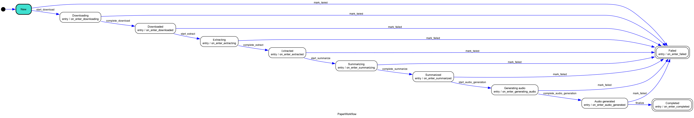

# Paper Podcasts

Transform research papers into audio podcasts using AI. Search arXiv, process papers through an intelligent pipeline, and listen to AI-generated summaries.

## Overview

Paper Podcasts is an automated pipeline that converts academic papers into audio summaries. It downloads papers from arXiv, extracts and processes their content using large language models, and generates podcast-style audio summaries using text-to-speech technology.

## Features

- **arXiv Integration**: Search and download papers directly from arXiv
- **Intelligent Processing Pipeline**: State machine-driven workflow ensures robust processing
- **AI-Powered Summaries**: Uses Anthropic's Claude to generate accessible summaries
- **Text-to-Speech**: Converts summaries to high-quality audio using OpenAI's TTS
- **Web Interface**: Streamlit-based UI for easy interaction
- **Persistent Storage**: Saves papers, summaries, and audio for later access
- **Resume Capability**: Can resume processing from any stage


## User Interface


## Pipeline Architecture

The processing pipeline is managed by a state machine that ensures reliable, step-by-step processing:



**Processing Stages:**
1. **Download**: Fetch PDF from arXiv
2. **Extract**: Convert PDF to structured text
3. **Summarize**: Generate accessible summary using LLM
4. **Audio Generation**: Convert summary to speech
5. **Complete**: Paper ready for listening

## Installation

### Prerequisites

- Python 3.12 or higher
- API keys for:
  - Anthropic (Claude)
  - OpenAI (TTS)

### Setup

1. Clone the repository:
```bash
git clone https://github.com/Fredheda/paper-podcasts.git
cd paper-podcasts
```

2. Install dependencies:
```bash
pip install -r requirements.txt
```

3. Create a `.env` file in the project root:
```bash
ANTHROPIC_API_KEY=your_anthropic_api_key
OPENAI_API_KEY=your_openai_api_key
```

## Usage

### Web Interface (Recommended)

Launch the Streamlit app:
```bash
streamlit run app.py
```

Then:
1. Search for papers on arXiv
2. Select papers to process
3. Monitor processing progress
4. Listen to generated podcasts in your library


## Project Structure

```
paper-podcasts/
├── src/
│   ├── models/          # Data models (Paper, Summary, Audio, etc.)
│   ├── services/        # External service integrations
│   │   ├── arxiv_service.py
│   │   ├── pdf_service.py
│   │   ├── llm_service.py
│   │   ├── audio_service.py
│   │   └── ...
│   └── pipeline/        # Processing pipeline
│       ├── paper_pipeline.py
│       ├── paper_workflow.py
│       └── assets/
│           └── state_machine_visualisation.png
├── prompts/             # LLM prompts
├── data/                # Processed papers storage
├── app.py               # Streamlit web interface
├── main.py              # CLI entry point
└── requirements.txt
```

## Configuration

The pipeline can be configured through constructor parameters:

- `storage_dir`: Directory for storing papers and outputs (default: `data/`)
- LLM provider and model selection
- TTS provider and voice options
- Processing stages to run

## Acknowledgments

- Built with [Anthropic Claude](https://www.anthropic.com/)
- TTS powered by [OpenAI](https://openai.com/)
- Papers sourced from [arXiv](https://arxiv.org/)
